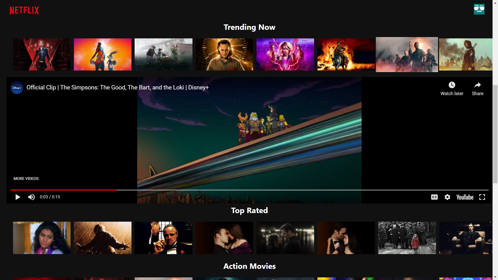

# **Netflix Clone using React**

- ### It's basically a clone of NetFlix where user can see the latest, upcoming, action, comedy & horror movies.

---

- ### User can also watch the trailer or videos associated with the movie as we've embed youtube inside the app.

---

- ### Moto behind developing this app to have hands on API calls, testing, fetching the data from API.

---

- ### For the news data, I've used TheMovieDB

  - [TheMovieDB.org API](https://www.themoviedb.org/)

  ***

- ### For the data fetching , I've used axios i.e. npm package
  - [axios](https://www.npmjs.com/package/axios)

---

- ### React app is deployed on **Firebase**.

  - [View React App](https://netflix-clone-f5dcd.web.app/)

---

### Screenshots of App

---

#### _Home Page_

#### _Streaming trailer using react-youtube_

#### _Mobile view_

## Getting Started with Create React App

---

This project was bootstrapped with [Create React App](https://github.com/facebook/create-react-app).

In the project directory, you can run:

### `yarn start`

Runs the app in the development mode.\
Open [http://localhost:3000](http://localhost:3000) to view it in the browser.

The page will reload if you make edits.\
You will also see any lint errors in the console.

### `yarn test`

Launches the test runner in the interactive watch mode.\
See the section about [running tests](https://facebook.github.io/create-react-app/docs/running-tests) for more information.

### `yarn build`

Builds the app for production to the `build` folder.\
It correctly bundles React in production mode and optimizes the build for the best performance.

The build is minified and the filenames include the hashes.\
Your app is ready to be deployed!

See the section about [deployment](https://facebook.github.io/create-react-app/docs/deployment) for more information.
